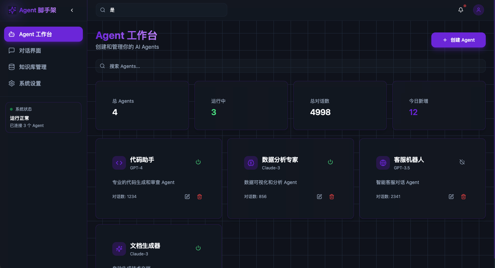
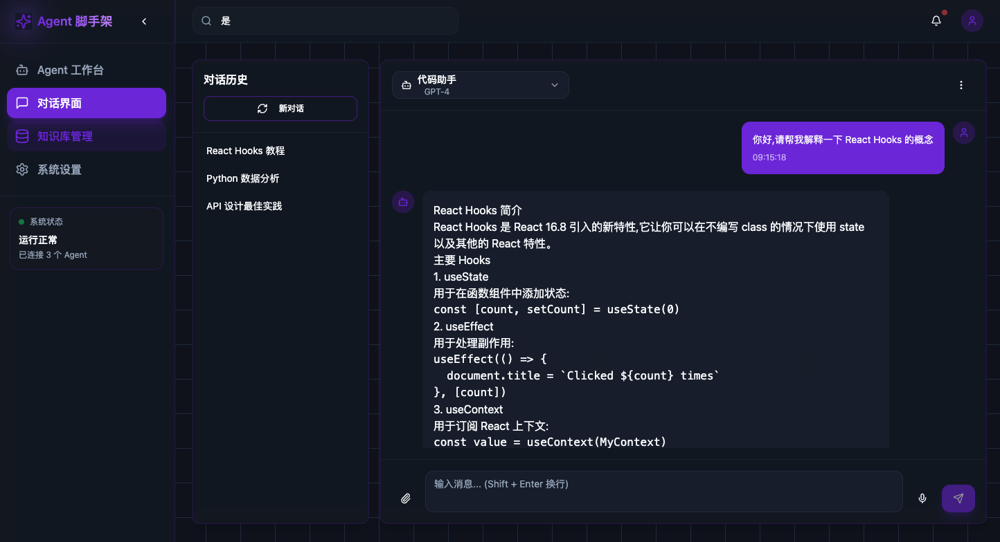
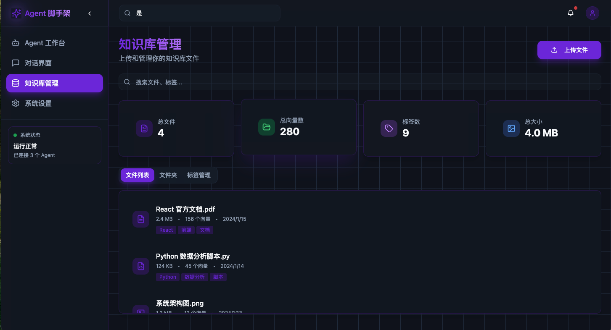
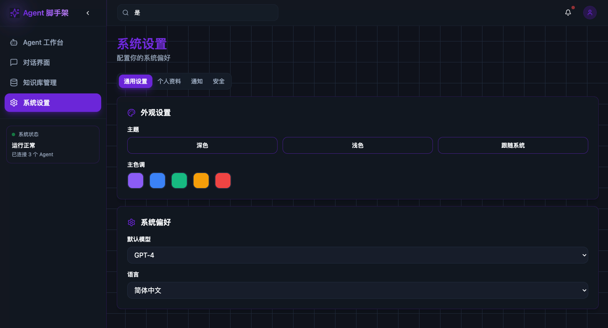

# Agent Web Template

企业级 Agent 脚手架前端系统 - 基于 Vite + React + TypeScript 开发的现代化 AI 管理平台，采用科技感深色主题设计。

## ✨ 特性

- 🎨 **科技感深色主题** - 采用紫色渐变、霓虹发光效果和玻璃态设计
- 🤖 **Agent 工作台** - 可视化创建、配置和管理 AI Agents
- 💬 **对话界面** - 流式对话交互，支持 Markdown 渲染
- 📚 **知识库管理** - 文档上传、向量化和检索管理
- ⚡ **Vite + React 18** - 极速的开发体验
- 🎯 **TypeScript** - 类型安全的开发
- 🧩 **shadcn/ui** - 基于 Radix UI 的高质量组件
- 🎨 **Tailwind CSS** - 高度可定制的样式系统

## 📸 界面展示

### 1. Agent 工作台


**功能亮点:**
- 🎯 **可视化 Agent 管理** - 卡片式展示所有 AI Agents
- ⚡ **一键创建** - 快速创建新的 Agent
- 🔄 **实时状态** - 绿色/灰色图标显示运行状态
- 📊 **统计仪表盘** - 总 Agents、运行中、总对话数、今日新增
- 🔍 **智能搜索** - 快速查找目标 Agent
- ⚙️ **灵活配置** - 支持 4 种 Agent 类型(编程/分析/服务/写作)
- 🤖 **多模型支持** - GPT-4、Claude-3、GPT-3.5

**Agent 类型:**
- 💻 编程助手 - 代码生成和审查
- 🧠 数据分析 - 数据可视化和分析
- 🌐 客户服务 - 智能客服对话
- ✨ 文档写作 - 自动生成技术文档

### 2. 对话界面


**功能亮点:**
- 💬 **实时对话** - 流式 AI 回复，打字机效果
- 🎨 **Markdown 渲染** - 支持代码高亮、格式化文本
- 📋 **对话历史** - 左侧边栏展示历史会话
- 🤖 **Agent 切换** - 下拉选择不同的 Agent
- 📎 **附件上传** - 支持文件上传(预留功能)
- 🎤 **语音输入** - 语音转文字输入(预留功能)
- ⏱️ **时间戳** - 每条消息的时间记录

**界面特色:**
- 用户消息 - 紫色背景，右侧显示
- AI 消息 - 深色背景，Markdown 渲染
- 输入中动画 - 三个跳动的圆点
- 自适应高度输入框 - Shift+Enter 换行

### 3. 知识库管理


**功能亮点:**
- 📁 **文件上传** - 拖拽或点击上传
- 🏷️ **标签系统** - 自定义标签分类
- 📊 **文件统计** - 总文件、总向量数、标签数、总大小
- 🔍 **搜索过滤** - 按文件名或标签搜索
- 📄 **多格式支持** - PDF、MD、TXT、PY、JS、PNG、JPG 等
- ⚡ **向量化状态** - 实时显示处理状态(已索引/处理中)

**文件信息展示:**
- 文件类型图标(文档/代码/图片)
- 文件大小和向量数量
- 上传时间
- 彩色标签
- 操作菜单(查看/编辑/删除)

**三大管理模块:**
- 文件列表 - 所有文件视图
- 文件夹管理 - 目录组织(即将推出)
- 标签管理 - 标签维护(即将推出)

### 4. 系统设置


**功能亮点:**
- 🎨 **外观设置** - 深色/浅色/跟随系统主题切换
- 🌈 **主色调** - 5 种预设颜色(紫/蓝/绿/橙/红)
- ⚙️ **系统偏好** - 默认模型、语言选择
- 👤 **个人资料** - 用户名、邮箱、个人简介
- 🔔 **通知设置** - 通知偏好配置(即将推出)
- 🔒 **安全设置** - 密码和安全选项(即将推出)

**标签页导航:**
- 通用设置 - 外观和系统偏好
- 个人资料 - 用户信息管理
- 通知 - 通知配置
- 安全 - 安全设置

## 🎨 设计特色

### 配色方案
- **主色调**: 紫蓝色系 (#8b5cf6)
- **背景色**: 深色渐变 (HSL: 220 30% 8%)
- **强调色**: 霓虹发光效果
- **文字色**: 高对比度白色/灰色

### 视觉效果
- **玻璃态** (Glassmorphism) - 半透明 + 模糊效果
- **霓虹边框** - 发光的紫色边框
- **渐变背景** - 深色到紫色的渐变
- **网格背景** - 科技感的网格图案
- **悬停动画** - 平滑的过渡效果
- **发光按钮** - 阴影和缩放效果

### 交互体验
- **响应式设计** - 适配各种屏幕尺寸
- **即时反馈** - 按钮和卡片的悬停效果
- **流畅动画** - 所有交互都有过渡动画
- **键盘导航** - 完整的键盘支持
- **无障碍访问** - ARIA 属性和语义化 HTML

## 🛠️ 技术栈

### 核心技术
- **Vite 6** - 极速构建工具
- **React 18** - UI 框架
- **TypeScript** - 类型安全
- **React Router v7** - 路由管理
- **Tailwind CSS** - 样式系统
- **shadcn/ui + Radix UI** - 组件库

### UI 组件
- 11 个核心 shadcn/ui 组件
- 完全自定义的主题系统
- 响应式布局设计
- 暗色模式优化

### 性能优化
- 代码分割和懒加载
- 虚拟滚动(长列表)
- 图片优化
- CSS 动画硬件加速

## 🚀 快速开始

### 安装依赖

```bash
npm install
```

### 启动开发服务器

```bash
npm run dev
```

访问 [http://localhost:3000](http://localhost:3000) 查看应用。

### 构建生产版本

```bash
npm run build
```

### 预览生产构建

```bash
npm run preview
```

## 📁 项目结构

```
agent-web-template/
├── src/
│   ├── components/
│   │   ├── layout/          # 布局组件
│   │   │   ├── sidebar.tsx  # 侧边栏导航
│   │   │   ├── header.tsx   # 顶部导航栏
│   │   │   └── main-layout.tsx
│   │   └── ui/              # shadcn/ui 组件
│   ├── pages/               # 页面组件
│   │   ├── agent-workspace.tsx    # Agent 工作台
│   │   ├── chat-interface.tsx     # 对话界面
│   │   ├── knowledge-base.tsx     # 知识库管理
│   │   └── settings.tsx           # 系统设置
│   ├── lib/
│   │   └── utils.ts         # 工具函数
│   ├── App.tsx              # 应用入口
│   ├── main.tsx             # React 挂载点
│   └── index.css            # 全局样式
├── docs/                    # 文档和截图
├── index.html
├── package.json
├── tsconfig.json
├── vite.config.ts
└── tailwind.config.js
```

## 🎯 功能模块

### 1. Agent 工作台
- 创建和管理 AI Agents
- 配置 Agent 类型和模型
- 监控 Agent 状态
- 查看对话统计

### 2. 对话界面
- 实时流式对话
- Agent 切换
- Markdown 渲染
- 对话历史管理
- 附件上传(预留)

### 3. 知识库管理
- 文件上传
- 文件类型识别
- 标签管理
- 向量化状态监控
- 搜索和过滤

### 4. 系统设置
- 主题配置
- 个人资料
- 通知设置
- 安全设置

## 📱 使用场景

### 1. 企业内部 AI 平台
- 搭建企业内部的 AI Agent 管理
- 统一管理多个 AI 服务
- 知识库集中管理

### 2. 开发者工具
- AI 辅助编程
- 代码审查和生成
- 技术文档编写

### 3. 客户服务
- 智能客服机器人
- 知识库问答
- 多轮对话管理

### 4. 数据分析
- 数据可视化 Agent
- 自动生成报告
- 智能数据洞察

## 🔧 配置

### 环境变量

创建 `.env` 文件:

```env
VITE_API_URL=http://localhost:8000
VITE_WS_URL=ws://localhost:8000
```

### API 代理

`vite.config.ts` 中已配置代理:

```typescript
server: {
  port: 3000,
  proxy: {
    '/api': {
      target: 'http://localhost:8000',
      changeOrigin: true,
    },
  },
}
```

## 📦 核心依赖

- **react**: ^18.3.1
- **react-router-dom**: ^7.1.1
- **@tanstack/react-query**: ^5.62.11
- **zustand**: ^5.0.2
- **tailwindcss**: ^3.4.17
- **@radix-ui/*** 各种 UI 原语组件
- **lucide-react**: 图标库

## 📚 相关文档

- [架构文档](./ARCHITECTURE.md) - 详细的架构设计
- [快速开始](./QUICKSTART.md) - 快速上手指南

## 📝 更新日志

### v0.0.1 (2026-02-10)
- ✨ 初始版本发布
- 🎨 科技感深色主题
- 🤖 Agent 工作台
- 💬 对话界面
- 📚 知识库管理
- ⚙️ 系统设置

## 🤝 贡献

欢迎提交 Pull Request!

## 📄 许可证

MIT License

---

**Made with ❤️ using React + Vite + Tailwind CSS**
